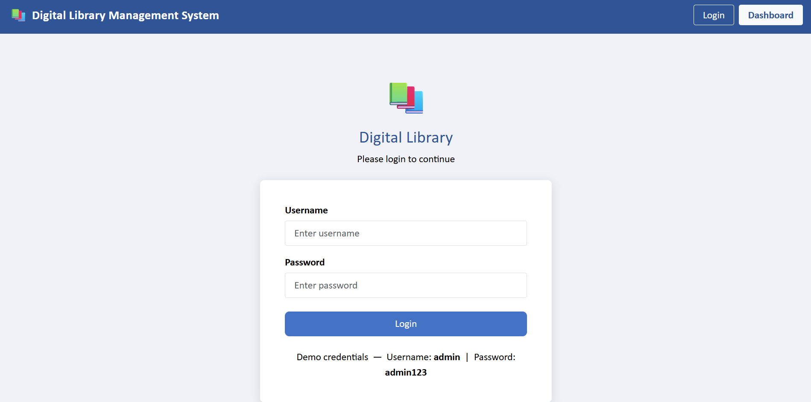
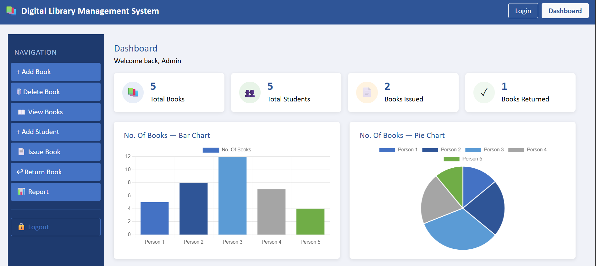
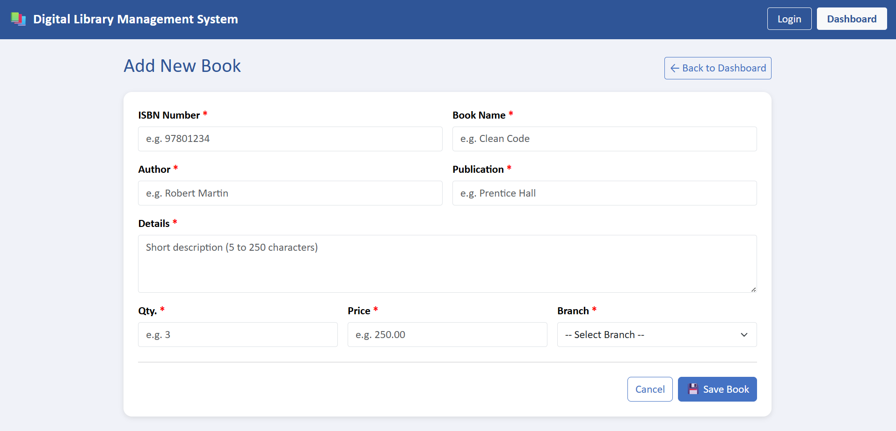
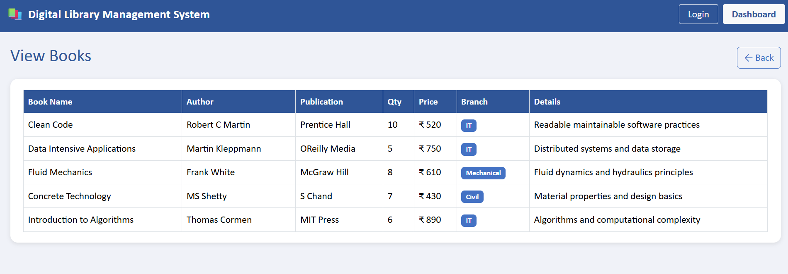
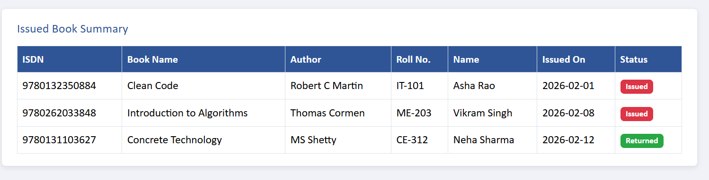
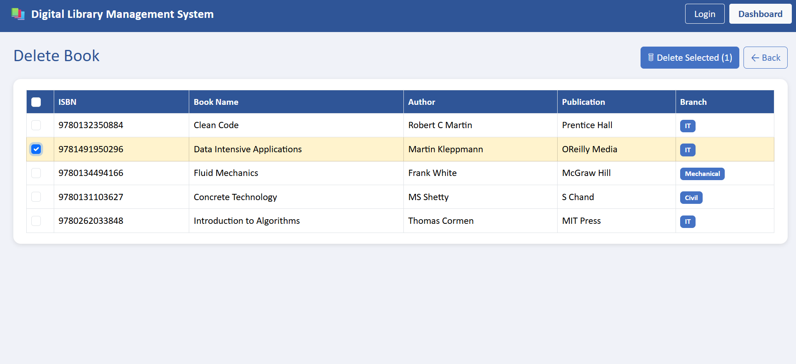

# Digital Library Management System

An Angular 19 + Bootstrap 5 web application for managing a digital library — track books, students, issuances, and returns in one place.

## Tech Stack

| Layer        | Technology              |
|-------------|-------------------------|
| Framework    | Angular 19 (standalone) |
| UI Library   | Bootstrap 5             |
| Charts       | Chart.js                |
| Language     | TypeScript              |
| Styles       | SCSS                    |

## Features

| Screen         | Description                                                                         |
|---------------|-------------------------------------------------------------------------------------|
| **Login**      | Username + password reactive form with validation                                   |
| **Dashboard**  | Sidebar navigation, Bar chart & Pie chart (Chart.js), Issued Book Summary table     |
| **Add Book**   | Reactive form — ISBN (numeric, 5–50), Name/Author/Publication (alpha, 5–50), Details (alphanumeric, 5–250), Qty (1–5 digits), Branch dropdown |
| **Delete Book**| Tabular list with checkbox selection column                                         |
| **View Books** | Read-only table: Name, Author, Publication, Qty, Price, Branch, Details             |

## Design Specifications

- **Font:** Calibri, 18 px globally  
- **Heading colour:** `#2F5597`  
- **Button colour:** `#4472C4`  
- **Label colour:** `#000000`  
- Responsive Bootstrap grid throughout

## Getting Started

### Prerequisites
- Node.js 18+
- Angular CLI (`npm i -g @angular/cli`)

### Install dependencies
```bash
npm install
```

### Run development server
```bash
npm start
```
Open `http://localhost:4200/` in your browser.

### Build for production
```bash
npm run build
```
Artifacts are placed in `dist/invensoft-assignment/`.

## Project Structure

```
src/
  app/
    components/
      login/
      dashboard/
      add-book/
      delete-book/
      view-book/
    models/
      book.model.ts
      student.model.ts
    app.routes.ts
    app.config.ts
    app.ts
  styles.scss
```

## Screenshots

### Login


### Dashboard


### Add Book


### View Books


### Issue Book


### Delete Book


## Routes

| Path           | Component        |
|---------------|-----------------|
| `/login`       | LoginComponent   |
| `/dashboard`   | DashboardComponent |
| `/add-book`    | AddBookComponent |
| `/delete-book` | DeleteBookComponent |
| `/view-book`   | ViewBookComponent |
